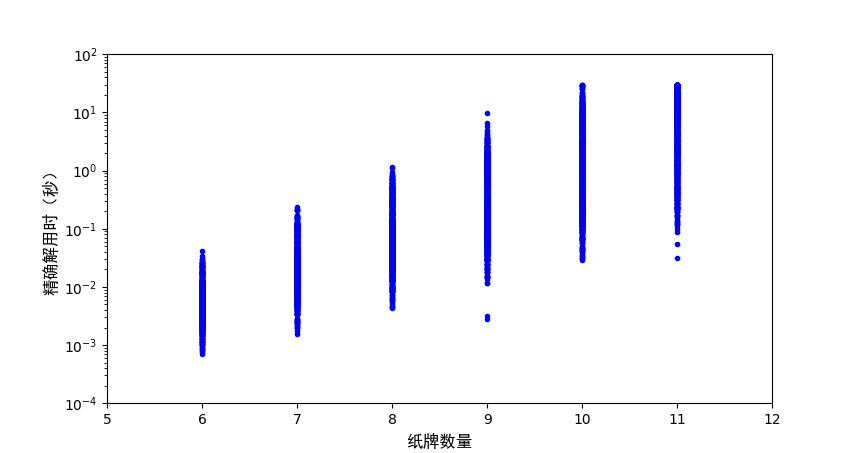
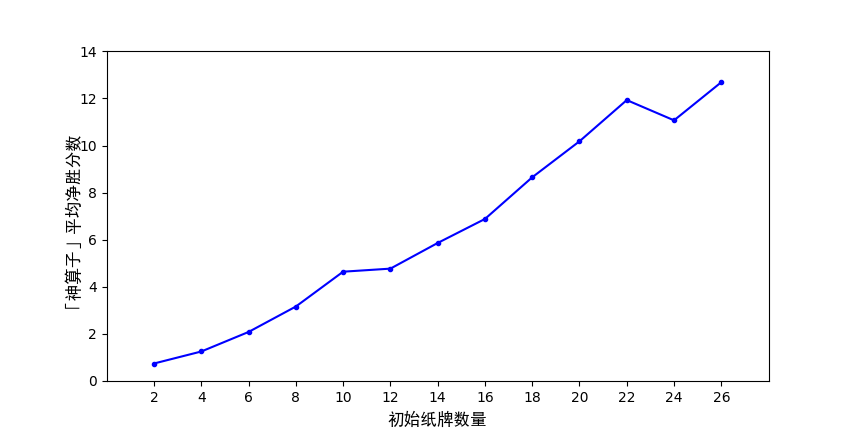

---
geometry:
  - hmargin=3cm
  - vmargin=4cm
toc: true
header-includes:
- \setCJKsansfont{SimSun}
---

\newpage

\begin{abstract}
本文中，我们首先介绍 Big2 纸牌游戏并简要回顾博弈智能体的设计史，然后基于极大极小化算法实现了一个 Big2 纸牌游戏智能体「神算子」。「神算子」不仅利用了缓存和 $\alpha$-$\beta$ 剪枝技术加速了精确解的求算，还利用了迭代深入搜索技术实现了问题规模较大时近似解的求算。理论分析与实战均表明「神算子」具有较好的性能。
\end{abstract}

# 引言

## Big2 游戏概述

以「斗地主」为代表的一类传统中国纸牌游戏广受大家欢迎。这类纸牌游戏具有以下特点：

- 使用一副（54 张）标准纸牌
- 忽略花色，仅比较点数大小
- 牌型多样
- 以首先出完手中的纸牌为胜利的标准

本项目中，我们提取这类纸牌游戏的共同点，并进行一定的简化，得到的规则为：

- 纸牌**点数**的大小顺序（从小至大）为 3, 4, ..., K, A, 2，每种纸牌各 4 张，共 52 张
- 允许的牌型包括：
  - **单**：一张纸牌
  - **双**：两张点数相同的纸牌
  - **三**：三张点数相同的纸牌
  - **三带一**：「三」与点数不等的「单」组合
  - **三带二**：「三」与点数不等的「双」组合
  - **炸弹**：四张点数相同的纸牌
  - **连单**：点数相连的 5 个及以上「单」组合
  - **连双**：点数相连的 2 个及以上「双」组合
  - **连三**：点数相连的 2 个及以上「三」组合
  - **连三带一**：点数相连的 2 个及以上「三」组合，加上同样数量的既不同于前述点数也各不相同的「单」
  - **连三带二**：点数相连的 2 个及以上「三」组合，加上同样数量的既不同于前述点数也各不相同的「双」

其中，「点数相连」包括按 3, 4, ..., 2 的大小顺序相连，也包括 A, 2 与 3 的相连，但 A, 2 不能同时与 3 和 K 相连。方便起见，我们称所有「连」类牌型末尾的一张牌称为**主牌**，且相同「连」类牌型的大小关系定义为主牌的大小关系。

在一个牌局中，两位智能体对战，当其中一方出尽手中的牌时，另一方手中的牌的张数即是自己的得分，对方得同样大小的负分。显然，该纸牌游戏属于零和博弈。以下我们称之为「**Big2 纸牌游戏**」。

## 博弈智能体设计概述

博弈是人类智力对抗活动的总称，也是最能够展现人类智力的一类行为。自计算机发明以来，几代人在能够进行博弈的计算机智能体的开发工作中发展出了大量有效的方法。博弈可以形式化为包含如下要素的搜索问题：

- **状态** `state`：博弈的任一时刻对系统情况的描述；
- **行动** `action`：系统可能发生的变化；
- **生枝函数** `branch(state) -> list[action]`：某一状态对应的可能下一步行动；
- **演化函数** `evolve(state, action) -> state`：状态经由某个行动后达到的新状态；
- **终止判断** `isTerminated(state) -> bool`：判断某状态是否使博弈终止；
- **效用函数** `evaluate(state) -> real`：若博弈终止，判断该状态对各智能体的效用。

在博弈中，每一智能体可以采取不同的策略，相应的结果也不同。若各智能体采取的策略使得任何智能体都无法通过改变策略获取更大的效用时，则称博弈达到了 **Nash 均衡**。1912 年，Ernst Zermelo 提出了 **Zermelo 定理**：任何信息完全的零和博弈在 Nash 均衡的意义下存在唯一的结果。对于两智能体的博弈来说，这一定理可以等价地表述为**极小极大化算法**（马上会介绍），它可以方便地在计算机上实现。1956 年，John McCarthy 提出 **$α$-$β$ 剪枝**的概念，大大提高了极小极大化算法的搜索效率，这一方法后来被证明为在固定深度的搜索算法中渐近最优。很快，极小极大化算法、$α$-$β$ 剪枝和对中间状态的**效用估计函数** `estimate(state) -> real` 组合在一起，就成为了计算机博弈智能体设计中的「**标准方法**」。

「标准方法」首先在国际象棋的智能体设计中展露锋芒。1997 年，由 IBM 开发的深蓝（Deep Blue）计算机击败了当时的世界冠军 Garry Kasparov。深蓝的成功源于复杂的评估函数、开局和残局数据库、可变搜索深度和强大的计算力（能够实现 14 层以上的搜索），但「标准方法」的指数复杂度阻止了它的进一步发展。21 世纪以来，**Monte Carlo 树搜索**逐渐成为了博弈智能体的主流，以围棋为例，2009 年以后所有一流的围棋智能体均使用 Monte Carlo 树搜索算法，大名鼎鼎的 AlphaGo 和 AlphaGo Zero 也不例外。[^ai]

尽管「标准方法」的效率不够高，但考虑到 Big2 纸牌游戏的搜索空间不大以及设计效用估计函数的可行性（见第四章），本项目中仍然采用该方法。

# 基本算法

## 状态与行为

我们首先讨论如何表示系统的状态和行为。我们将纸牌 3, 4, ..., 2 映射为指标 0, 1, ..., 12，并利用一个长度为 13 的**手牌列表** `hand` 分别存储它们的张数，使得 `hand[index]` 即是指标为 `index` 的纸牌的张数。其次，我们充分思考不同牌型的相同点与不同点，认为任何牌型可以由 5 个要素描述：

1. **主牌指标** `tail`，例如牌型 `33344456` 的主牌指标是 `1`；
2. **长度** `length`，例如牌型 `33344456` 的长度是 `2`；
3. **容量**（主牌在牌型中出现的次数） `size`，例如牌型 `33344456` 的容量是 `3`；
4. **带牌容量**（在（连）三带一或（连）三带二中带牌的张数） `affiliationSize`，例如牌型 `33344456` 的带牌容量是 `1`；
5. 带牌的具体内容。

其中，前 4 个要素为关键要素，决定了该牌型与其他牌型的大小关系，而第 5 个要素为非关键要素。因此，我们用一个**牌型四元组** `action = (tail, length, size, affiliationSize)` 表示一个牌型，而忽略带牌的具体内容。

## 生枝函数

定义好手牌列表和牌型四元组的数据结构后，我们考虑用动态规划实现生枝函数，也即在给定对方的牌型四元组的情况下，当前手牌列表可以给出哪些行动。我们首先考虑比较复杂的情况，即上一轮对手「不出」，本轮可以出任意牌型。此时动态规划关系可以表示为：

> 主牌指标不大于 `i` 的所有牌型 + 主牌指标为 `i + 1` 的所有牌型 = 主牌指标不大于 `i + 1` 的所有牌型

我们对手牌列表进行遍历，对每个主牌指标依次判断相应纸牌是否至少有 1 张、2 张和 3 张，根据这些结果找出所有以该牌为主牌的牌型。最后，我们再判断对应于每个主牌指标是否有炸弹。若不考虑（连）三带一和（连）三带二导致的再次遍历，则该动态规划算法最差情况下是 $O(n^2)$ 的。

反之，若上一轮对手打出某一牌型，则该牌型具有主牌 `i`，我们只需要将同样的动态规划算法应用于特定长度、容量和带牌容量的牌型，并从 `i` 开始进行动态规划即可。具体实现详见代码。

## 智能体「智多星」

在我们建立实用的智能体前，我们首先研究一些比较简单的智能体。*水浒传中，梁山好汉排行第三的吴用是一位满腹经纶、足智多谋的军师，常以诸葛亮自比，道号「加亮先生」，人称「智多星」。*以下我们用「智多星」（英文：Smart Big2 Agent）[^app1]代指遵循以下简单策略的智能体：

1. 如果自己出牌前对手打出了牌，则按如下顺序考虑，找到一个可能性就出牌：
   1. 属于同一类牌型的、大于对手的、主牌尽可能小的牌型；
   2. 主牌尽可能小的炸弹；
   3. 不出。
2. 如果自己出牌前对手没有打出牌，则按如下顺序考虑，找到一个可能性就出牌：
   1. 总牌数尽可能多、主牌尽可能的小的牌型；
   2. 主牌尽可能小的炸弹；

「智多星」的策略反映了一种行动的排序，也即在已知信息有限时，我们总是倾向于出尽可能长、尽可能小的牌，使得我们在之后的优势可能较大。我们将这种排序方法称为「智多星排序」。这一选择与游戏的评分机制有关（只考虑博弈结束时一方的牌数，所以即使因为出长牌时把大牌都出掉导致输牌，也输不了多少）。以下我们会看到，「智多星」对于设计更好的智能体提供了非常重要的启示。

[^app1]: 命名灵感来自手机游戏「欢乐斗地主」的残局模式。

# 精确解

## 智能体「神算子」

我们现在开始设计本项目用于正式参赛的智能体。*水浒传中，排行五十三位的蒋敬乃潭州人氏，落科举子出身；原为黄门山二寨主，后因钦慕宋江而到梁山入伙，负责考算山寨钱粮。蒋敬精通书算，用算盘运算时能「积万累千，纤毫不差」，人称「神算子」。一百二十回本中有诗赞曰：「如神算法善行兵，文武全才蒋敬」。*我们将该智能体称为「神算子」（英文：Awesome Big2 Agent）[^app2]，它的目标是超越「智多星」所作出的简单排序，尽可能接近 Nash 均衡意义下的最优解。在最优解中，「神算子」作出的任何决策总是使自己的效用极大化，而对手作出的任何决策总是使「神算子」的效用极小化。这一过程可以用伪代码表示为[^minimax]：

```python
def minimax(state):
    if isTerminated(state):
        return evaluate(state)
    if current player is AwesomeBig2Agent:
        utility = MIN_UTILITY
        for action in branch(state):
            newState = evolve(state, action)
            utility = max(utility, minimax(newState))
        return utility
    else # current player is Opponent
        utility = MAX_UTILITY
        for action in branch(state):
            newState = evolve(state, action)
            utility = min(utility, minimax(newState))
        return utility
```

[^app2]: 命名灵感也来自手机游戏「欢乐斗地主」的残局模式。
[^minimax]: https://en.wikipedia.org/wiki/Minimax

不过，这一算法的缺点是很多代码要重复写两遍。为此我们采用与极小极大化算法等价的一套表述，即负值极大化算法：由于博弈是零和博弈，任一状态对「神算子」的效用总是对对手的效用的负值，因此只需要将各个分支上的效用取负值，然后统一取极大值即可。它的伪代码表示为[^negamax]:

[^negamax]: https://en.wikipedia.org/wiki/Negamax

```python
def negamax(state):
    if isTerminated(state):
        return evaluate(state)
    utility = MIN_UTILITY
    for action in branch(state):
        newState = evolve(state, action)
        utility = max(utility, -negamax(newState))
    return utility
```

## 缓存

显然，负值极大化算法是一个递归算法，通过加入缓存可以大大提高其效率。缓存逻辑的伪代码可以表示为一个装饰器（尽管实际并不采用装饰器实现）：

```python
def decorator(negamax):
    def wrapper(state):
        if state in cache: return cache[state]
        utility = negamax(state)
        cache[state] = utility
        return utility
    return wrapper
```

在具体实现中，我们用己方手牌列表和对方手牌列表分别元组化后和牌型四元组相加，得到的 30 元组作为字典的键。

## $\alpha$-$\beta$ 剪枝

在负值极大化算法中，我们容易发现有些计算是冗余的：从根节点出发，若在某一层中对手已经发现了一个使我们获得较少效用的树枝，则其余极小极大值大于该效用值的树枝都是无效的（因为对手不可能主动走入该树枝）。因此，我们此时可以立即截断该树枝的计算并返回。我们用 $\alpha$ 代指该条路径上己方效用的极大值，$\beta$ 代指该条路径上对方能使己方效用达到的最小值，则 $\alpha$-$\beta$ 剪枝的伪代码可以表示为：

```python
def negamax(state, alpha, beta):
    if isTerminated(state):
        return evaluate(state)
    utility = MIN_UTILITY
    for action in branch(state):
        newState = evolve(state, action)
        utility = max(utility, -negamax(newState, -beta, -alpha))
        alpha = max(alpha, utility)
        if alpha >= beta: break
    return utility
```

此时我们应该注意到，对 $\alpha$-$\beta$ 剪枝来说，采用不同顺序访问子节点导致能剪掉的树枝数目是不同的。若我们将比较有优势的树枝放在前面访问，则倾向于能剪掉更多的树枝。此时，「智多星排序」就派上了它的用场：**我们先验地指定 $\alpha$-$\beta$ 剪枝中子节点访问的顺序即是「智多星排序」**。

# 近似解

## 效用估计函数

经缓存和 $\alpha$-$\beta$ 剪枝加速的「神算子」已经能够对「10 + 10」以内（指双方均不超过 10 张牌）的问题瞬间完成求解，并能对大多数「15 + 15」以内的问题在规定时间内完成求解。然而，由于手牌的上限为 26 张，当前的「神算子」还不能满足需求。根本原因在于，极小极大化（或负值极大化）算法必须将博弈树搜索至叶结点才能得到根节点的效用，而在手牌多的时候是不可能实现的。这与人类进行 Big2 纸牌游戏的行为不同：人类总是向前推演几步，并在合适的时机停下来估计非叶节点的效用，然后据此作出决策。借鉴人类的决策方式，我们需要对非叶节点设计效用估计函数。

尽管一个好的效用估计函数往往能够大大提高智能体的性质（例如，深蓝的复杂估值函数），考虑到本项目作为数据结构与算法的习题的本质，我们在此不宜调整过多参数。我们采取一个非参数的、简单而有效的策略来估计：**一个非叶节点的效用估值是对方剩余纸牌数量减去己方剩余纸牌数量。**选择这一策略的原因与选择「智多星排序」的原因相同。

## 迭代深入搜索

给定估计函数，我们可以设定一个搜索深度，达到该深度时停止继续生枝并应用估计函数完成估计。但是，我们观察到对于同一深度而言，不同牌局完成该深度的搜索所需要的时间差异巨大，且无法从牌的数量出发作简单的预测；若设置搜索深度过低则不易算准，过高则易超时。我们因此采取「**迭代深入搜索**」的策略：首先设定初始深度，搜索完成后逐渐增加搜索深度，保存每一步所得到的最优牌型；一旦时间截止，则立刻返回目前所进行的最深搜索所给出的解。用于控制时间的伪代码可以表示为：

```python
def decorator(negamax):
    def wrapper(state):
        visitedNodes += 1
        if visitedNodes % CHECK_TIMEOUT_EVERY == 0:
            end = time.time()
            if end - start > TIME_LIMIT - 1: raise TimeoutError()
        utility = negamax(state)
        return utility
    return wrapper
```

我们将上述策略再明确地进行参数化：

- **近似阈值** `ESTIMATION_THRESHOLD`：当双方初始纸牌数量中较大者大于该值时，启用近似解；
- **初次搜索深度** `FIRST_DEPTH`：保证对于任何牌局都能完成的搜索深度。

我们取双方初始纸牌数量均为 6 ~ 11，随机生成 1000 个牌局，计算「神算子」在第一轮出牌中需要耗费的时间如下图。在多个随机样本中，耗费时间的最大值与牌数近似呈线性关系。虽然在初始纸牌数量为 10 时绝大多数牌局的计算时间在 1 秒以内，但有 3 例牌局超过了 30 秒。因此我们将近似阈值设为 10。



初次搜索深度也可以用类似方法确定。下图展示了取双方初始纸牌数量为 26 时，令初始深度为 4 ~ 8 并分别随机生成 100 个牌局，「神算子」在第一轮出牌中需要耗费的时间。据此我们取初次搜索深度为 8。我们将这种参数最优化的「神算子」智能体记为「神算子(10, 8)」。


# 结果与讨论

## 「神算子」与「智多星」性能比较

当「神算子」的近似阈值取 0，初次搜索深度取 1 且完成后不深入搜索时，「神算子(0, 1)」即自动退化为「智多星」。我们取双方初始纸牌数量为 2, 4, ..., 26，各随机生成 100 局并令「神算子(10, 8)」与「智多星」分别作为先手与后手各打一局，计算「神算子(10, 8)」净胜的分数如下图，可见「神算子」较纯粹启发式的「智多星」有明显的优势，且该优势随问题规模的增加而增加。



<!-- ## 「神算子」与其他智能体性能比较 -->

# 结论

在本项目中，我们首先学习了博弈智能体设计的相关知识，将 Big2 纸牌游戏的智能体设计问题转化为一个树搜索问题，并利用树搜索的经典算法即极小极大化（或曰负值极大化）算法构建了智能体「神算子」的基本框架。为了提高智能体的性能，我们不仅利用了缓存技术，还提出了启发式排序「智多星排序」，将这一启发式排序应用于 $\alpha$-$\beta$ 剪枝。最后，我们设计了一个简单而有效的非叶节点效用估计函数，提出利用迭代深入搜索的办法来满足时间限制的要求，并在这一限制内对参数进行了优化。参数调优得到的「神算子(10, 8)」智能体具有良好的性能，相比于启发式智能体「智多星」有着明显的优势。

尽管本项目对精确解的算法作出了较好的优化，但由于时间的限制，我们并未对问题的复杂性进行深入的理论分析，这阻止了进一步的优化。例如，我们注意到精确解求解用时与初始纸牌数量的关系的散点图中，同样的手牌数量导致的用时可以相差 4 个数量级，我们未能对此作出解释并找到更准确的描述问题复杂度的指标，从而提高近似阈值。除此之外，更多有益的近似方法（例如，前向剪枝、空招和徒劳修剪）[^ai]也可能对提升智能体的性能有所帮助。我们希望能够与参与本次比赛的其他队伍就这些问题进行交流。

[^ai]: Russell S, Norvig P. Artificial intelligence: a modern approach[J]. 2002.